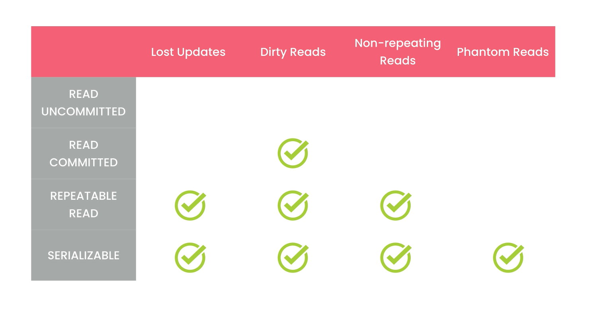
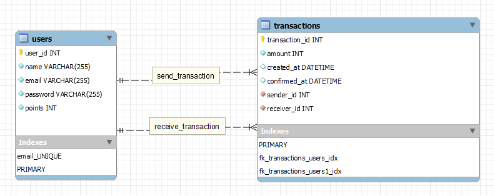

#

<!-- TABLE OF CONTENTS -->
<details>
  <summary>Table of Contents</summary>
  <ol>
    <li>
      <a href="#points-system">About The Project</a>
      <ul>
        <li><a href="#built-with">Built With</a></li>
      </ul>
    </li>
    <li>
      <a href="#getting-started">Getting Started</a>
      <ul>
        <li><a href="#prerequisites">Prerequisites</a></li>
        <li><a href="#installation">Installation</a></li>
      </ul>
    </li>
    <li><a href="#contributing">Contributing</a></li>
    <li><a href="#acknowledgments">Acknowledgments</a></li>
  </ol>
</details>

<!-- ABOUT THE PROJECT -->

## Points-System

simple web application that allows users to transfer their loyalty points to each other.

### Built With

- Back-end -> Node.js, Express.js, Bycrypt, crypto-js, express-validator, jsonwebtoken.

- Database-> MySQL(MySQL2).

<!-- GETTING STARTED -->

## Getting Started

User should firstly signup with name, email and password to access the api, user will get 500 points gift when signig up, then by loging in with email and password, the user :
1- get his own points only.
2- make a transaction to transfer points to other users.
3- confirm transaction, then both users' points will be updated.
4- user cant send points to himself.
5- user can see all transactions.

Every route is protected by validation using express-validator and secured with autherization middleware so the logged in user just send from his balance.

The main challenge was to handle concurrent requests, so we can prevent common proplems like read-uncommited, so i used MySQL transactions with its default repeatable read isolation level.



The databse has 2 tables:
1- users which have: - id - name - email - password - points : default 500
2- transactions which have: - id - amount - created at : default CURRENT_TIMESTAMP - confirmed at : default null, when confirm the null will to change to CURRENT_TIMESTAMP - receiver id - sender id



### Prerequisites

- Node Js
  ```sh
  https://nodejs.org/en/download
  ```
- npm
  ```sh
  npm install npm@latest -g
  ```
- MySQL
  ```sh
  https://www.mysql.com/downloads/
  ```
- MySQL Workbench
  ```sh
  https://dev.mysql.com/downloads/workbench/
  ```

### Installation

1. Clone the repo
   ```sh
   git clone git@github.com:A-Aboshahba/points-system.git
   ```
2. Install NPM packages
   ```bash
   npm install
   ```
3. To create the database you should open the MySQL Workbench then do the following:
   ```
   file -> open model -> choose `points-system-erd.mwb` provided with this repo ->
   Database -> Forward engineering -> next -> next
   ```
4. create new file and name it `.env` then fill the following attributes with your data:
   ```js
   JWT_SEC_KEY = `your secrit key for jwt token`;
   PASS_SEC = `your password encryption key`;
   PORT = `prefered port to run the node js server`;
   DB_HOST = `database host, if local: localhost`;
   DB_USER = `your username for the database`;
   DB_PASSWORD = `your password for the database`;
   DB_NAME = `your database name`;
   ```

## Contributing

Contributions are what make the open source community such an amazing place to learn, inspire, and create. Any contributions you make are **greatly appreciated**.

If you have a suggestion that would make this better, please fork the repo and create a pull request. You can also simply open an issue with the tag "enhancement".
Don't forget to give the project a star! Thanks again!

1. Fork the Project
2. Create your Feature Branch (`git checkout -b feature/AmazingFeature`)
3. Commit your Changes (`git commit -m 'Add some AmazingFeature'`)
4. Push to the Branch (`git push origin feature/AmazingFeature`)
5. Open a Pull Request

<!-- ACKNOWLEDGMENTS -->

## Acknowledgments

- [Node](https://nodejs.org/en/docs)
- [MySQL](https://socket.io/docs/v4/)
- [Express.js](https://expressjs.com/en/5x/api.html)
- [MySQL2](https://www.npmjs.com/package/mysql2)

<p align="right">(<a href="#readme-top">back to top</a>)</p>
